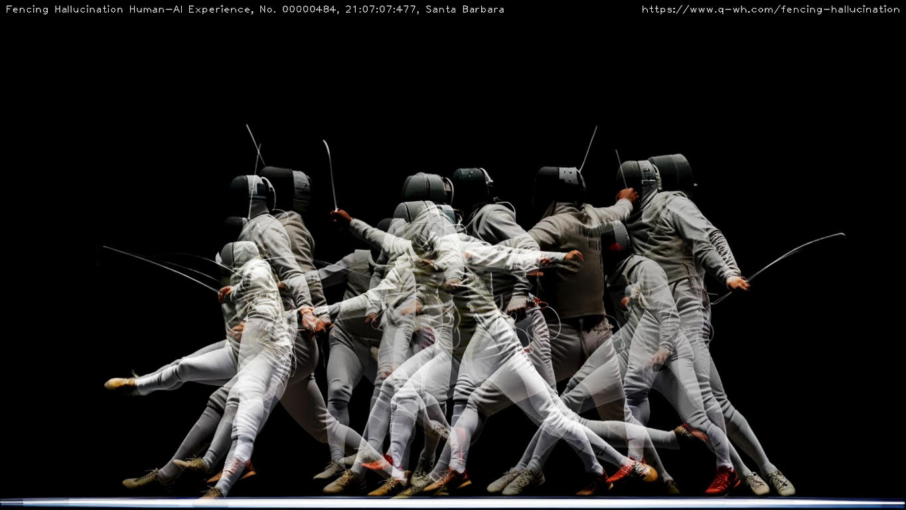

# NeurIPS 2024 Creative AI Track

(Image credit: Fencing Hallucination (2023), by Weihao Qiu)

Following last year’s incredible success, we are thrilled to announce the NeurIPS 2024 Creative AI track. We invite research papers and artworks that showcase innovative approaches of artificial intelligence and machine learning in art, design, and creativity. 

Focused on the theme of Ambiguity, this year’s track seeks to highlight the multifaceted and complex challenges brought forth by application of AI to both promote and challenge human creativity. We welcome submissions that: question the use of private and public data; consider new forms of authorship and ownership; challenge notions of ‘real’ and ‘non-real’, as well as human and machine agency; and provide a path forward for redefining and nurturing human creativity in this new age of generative computing. 

We particularly encourage works that cross traditional disciplinary boundaries to propose new forms of creativity and human experience. Submissions must present original work that has not been published or is not currently being reviewed elsewhere.

# Important Dates:

* August 2: Submission Deadline
* September 26: Decision 
* October 30: Final Camera-Ready Submission

# Call for Papers and Artworks

## Papers (posters)

We invite submissions for research papers that propose original ideas or novel uses of AI and ML for creativity. The topics of research papers are not restricted to the theme of ambiguity. **Please note that this track will not be part of the NeurIPS conference proceedings. If you wish to publish in the NeurIPS proceedings please submit your paper directly to the main track.**

To submit: We invite authors to submit their papers. We expect papers to be 2-6 pages without including references. The formatting instructions and templates will become available soon. The submission portal will open sometime in July.

## Artworks

We invite the submission of creative work that showcases innovative use of AI and ML. We highly encourage the authors to focus on the theme of Ambiguity.  We invite submissions in all areas of creativity including visual art, music, performing art, film, design, architecture, and more **in the format of video recording.** The submission portal will open sometime in July.

NeurIPS is a prestigious AI/ML conference that tens of thousands researchers from academia and industry attend every year. Selected works at the Creative AI track will be presented on large display screens at the conference and the authors will have the opportunity to interact with the NeurIPS research community to germinate more collaborative ideas.

To submit:  We invite authors to submit their original work. An artwork submission requires the following:

* Description (maximum 3 pages in PDF)
  * Description of the work and the roles of AI and ML 
  * Description on how the theme of Ambiguity is addressed
  * Biography of all authors including relevant prior works 
* Thumbnail image of the work (<100MB)
* 3-min video preview of the work (<100MB)

## Single-blind review policy

## Conference policy
If a work is accepted **at least one author must purchase a Conference & Tutorials registration and attend in person.** For pricing visit the [pricing page](https://neurips.cc/Conferences/2024/Pricing). For registration information visit the [registration page](https://neurips.cc/Register/view-registration). The location of the conference is Vancouver and the authors are responsible for their travel arrangements and expenses. The conference does not provide travel funding. 

# Contact

For updates, please check this website regularly.

To stay up-to-date with all future announcements, please join our mailing list creativeaiml@googlegroups.com.

For other inquiries, please contact creative-ai-chairs@neurips.cc.

* Jean Oh / roBot Intelligence Group / Carnegie Melon University
* Marcelo Coelho / Design Intelligence Lab / MIT
* Yingtao Tian / Google DeepMind
* Lia Coleman / Carnegie Melon University
* Peter Schaldenbrand / roBot Intelligence Group / Carnegie Melon University

